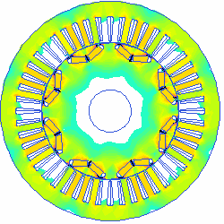
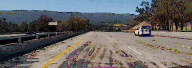

[//]: # (Image References)
[Wires]: ./images/wires_in_slots1.jpg "Wires"
[Circles]: ./images/circlepacking.gif "Circles"
[squares]: ./images/rectangular_fitting.png "squares"
[lanelines]: ./images/lanelines.gif "LaneLines"
[lanes]: ./images/lanefinding.gif "lanes"
[spirograph]: ./images/spirograph.png "Spirograph"
[harmonograph]: ./images/harmonograph.png "Harmonograph"
[stochasticmodelling]: ./images/stochasticmodelling.gif "Stochastic Modelling"
[swlayers]: ./images/swlayers.png "Layered approach"
[swlayers1]: ./images/RaNa_Target_Abstraction_Bootloader.png "layered approach"

I have several areas of interest - both technical and non-technical, just like everyone else. Below are some of the areas that I have passion for and worked on. 

##### e-mail:hex2ascii(72h 61h 67h 68h 75h 2Eh 65h 6Ch 65h 63h 40h 67h 6Dh 61h 69h 6Ch 2Eh 63h 6Fh 6Dh) (written in hex just to avoid detection by web crawlers) #####

## ToC ##

[Electro Mechanical Systems](#electro-mechanical-systems)

[Embedded Systems](#embedded-systems)

[Machine Learning](#machine-learning)

[Statistical Modelling](#statistical-modelling)

[Fun with Shapes](#fun-with-shapes)

# Electro Mechanical Systems #

### Electric Machine Design ###

I like to work with open source software. I used [Scilab](https://www.scilab.org/), [FEMM](http://www.femm.info/wiki/HomePage), [Gmsh](http://gmsh.info/), [GetDP](http://getdp.info/), and [Elmer](https://www.csc.fi/web/elmer)  to build my personal tool to generate variety of elecitrc machines models of BLDC type with surface mounted magnets (inner rotor, outer rotor), IPM Motors (inner rotor so far) and Synchronous Reluctance Motors (inner rotor so far). Also implemented parallel FEA computations in some cases for faster characterization of the motors. These models can be dynamically generated and can be fed to the optimization routine (for FEMM based workflow) that I implemented based on random walk methods. I call this tool "rlib".  Please visit the wiki page for rlib [HERE](https://bitbucket.org/saras152/rlib/wiki).

![alt text][Wires]

### Magnetic Gears ###

This is my attempt at magnetic gears with FEA simulations. Wiki page is coming up.

# Embedded Systems #

![Layered approach][swlayers]![Layered approach][swlayers1]

### Bootloader ###
* [File parsing](https://bitbucket.org/saras152/bootloader/wiki/Home)

### Data Acquisition System ###

* [Embedded USB Host Drivers](https://bitbucket.org/saras152/usbhost_embedded/wiki/Home).
* [SD CARD Access through SPI](https://bitbucket.org/saras152/filesystem_fat/wiki/SD%20CARD)
* [Embedded FAT32 drivers](https://bitbucket.org/saras152/filesystem_fat/wiki/Home).
* [Embedded FAT16 drivers](https://bitbucket.org/saras152/filesystem_fat/wiki/FAT%2016)

# Machine Learning #

### Vehicle detection and tracking

Used hog, spacial binning and color histograms features along with the Support Vector Machine module to train a linear classifier to detect the cars in an image. Used the same pipeline to implement the vehicle tracking in a video. Corresponding wiki is [HERE](https://github.com/saras152/myVehicleDetection)

### Computer Vision - Lane Finding ###

Used OpenCV's functionalities for camera calibration, distortion correction, perspective views and  warping, in combination with few  curve fitting functions to generate lane geometries from boundaries to identify the curvature and vehicle offset from lane center. The corresponding wiki is [HERE](https://github.com/saras152/myAdvancedLaneFinding).

![lane lines][lanes]

### Behavioral Cloning - driving the autonomous car in a simulator ###

Used Keras to simulate the autonomous car to make it run around the track without any acidents. The corresponding wiki is [HERE](https://github.com/saras152/myBehavioralCloningProject).

### Traffic Sign Classification ###

Used TensorFlow to classify few random images from the internet using the network trained using german traffic sign benchmarks. The corresponding wiki is [HERE](https://github.com/saras152/Traffic-Sign-Classifier).

### Computer Vision - Lane line identification ###

Used OpenCV to detect the lanelines on the road. The corresponding wiki is [HERE](https://github.com/saras152/Finding_Lane_Lines_on_the_Road). 

![alt text][lanelines]

# Statistical Modelling #

I attempted stochastic modelling for sales prediction. Although this is a primitive model, I liked the way I was able to represent the bias visualization. The wiki below also includes a paper I tried to create out of the work done for this. This paper was not published. The wiki is [HERE](https://bitbucket.org/saras152/marketmodellingstochastic/wiki/Home).

![Stochastic Modelling GIF][stochasticmodelling]

# Fun with Shapes #

## Polygon packing ##
I attempted to pack polygons ( circles and rectangles) in a given polygon. The wiki for it is [HERE](https://bitbucket.org/saras152/polygon_packing/wiki/Home).

![circles][Circles]
![squares][squares]

## Spirographs and Harmonographs ##
Created a MATLAB script to generate some images for fun! More images are [HERE](https://bitbucket.org/saras152/harmonograph/wiki).

![alt text][spirograph]
![alt text][harmonograph]

